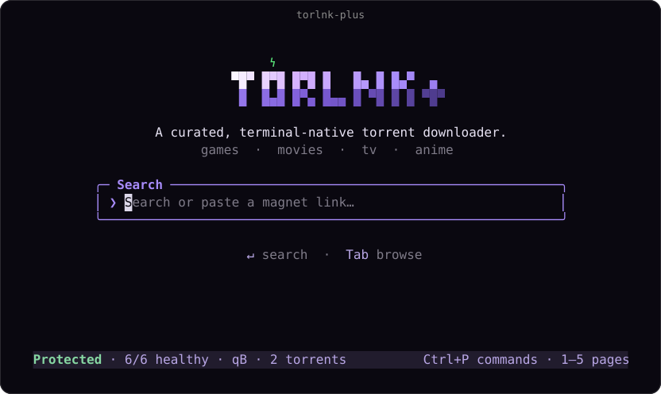

# Torlnk+

<p align="center"></p>

Torlnk+ is a terminal torrent client forked from [Torlnk](https://github.com/baairon/torlink). Search torrents and magnet links, import files, and manage transfers from one terminal UI.

- Search, paste magnets, or import torrent files.
- Use qBittorrent by default or choose WebTorrent for a download.
- Route through optional Windscribe profiles and switch between Direct and VPN.
- Check real piece progress, torrent details, and worker health.
- Keep downloads and seeding running after closing the UI.

## Requirements

Linux x64, Node.js `^22.22.2 || ^24.15.0 || >=26`, rootful Docker Engine 28+, and Docker Compose v2. VPN mode needs `/dev/net/tun`. Rootless Docker, macOS, Windows, and SELinux setups are unverified.

Install Node.js and Docker yourself. App dependencies are bundled; managed containers are built or pulled at startup.

## Install

```sh
npm install --global --ignore-scripts torlnk-plus@alpha
torlnk-plus doctor
torlnk-plus
```

On first run, press `4` for Settings, select `Global routing`, press Space to choose Direct or VPN, then press `S` to save. Import a VPN profile before choosing VPN. Transfers will not start until you choose a route.

## Keys

Outside text fields:

| Key | Action |
| --- | --- |
| `Ctrl+P` | Open the command palette |
| `1`–`5` | Search, Downloads, Seeding, Settings, Health |
| `V` | Toggle the saved Direct/VPN route |
| `Delete` | Stop and remove the selected torrent; keep its files |
| `Q` | Close the UI; transfers continue |

## Alpha limits

TCP 443 and Stealth are experimental. Container security advisories remain unresolved, and VPN failure coverage is incomplete. See the [security notes](SECURITY.md), [verification report](VERIFICATION.md), and [usage guide](docs/USAGE.md).

## Contributing

- Run `npm ci --ignore-scripts` to install dependencies and `npm run dev` to start the local UI.
- Before submitting changes, run `npm run typecheck` and `npm test`. See [CONTRIBUTING.md](CONTRIBUTING.md) for project boundaries and verification guidance.

## Privacy

- App state, VPN profiles, and downloaded files stay on your configured local paths.
- Search providers, trackers, and peers receive requests through your selected Direct or VPN route. Direct exposes your public IP; a VPN shifts trust to its provider and does not make you anonymous.
- Completed torrents seed by default until paused or stopped by configured ratio/time limits. Removing a torrent stops its transfer but keeps its files.

Based on upstream [Torlnk](https://github.com/baairon/torlink), commit `467c0e4c6c87e1977814e9d83649968ef7d8f088`. MIT license and attribution are retained in [LICENSE](LICENSE) and [README.upstream.md](README.upstream.md).
